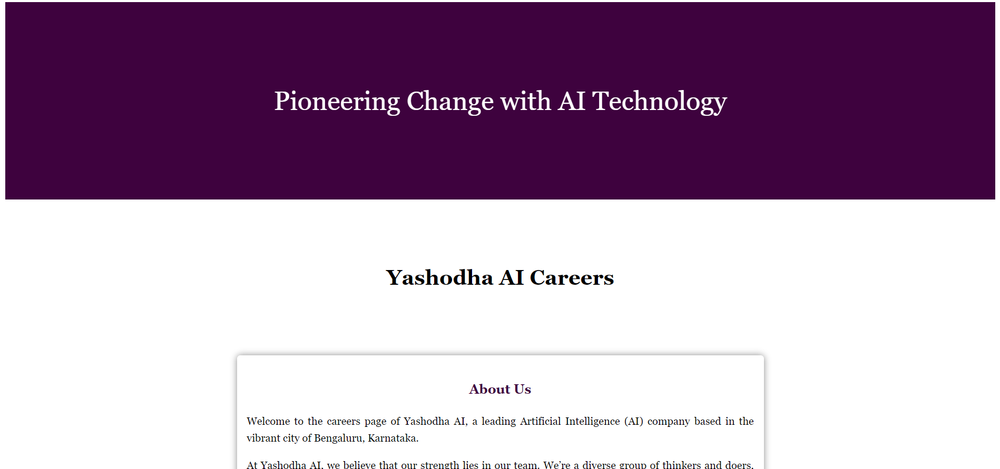
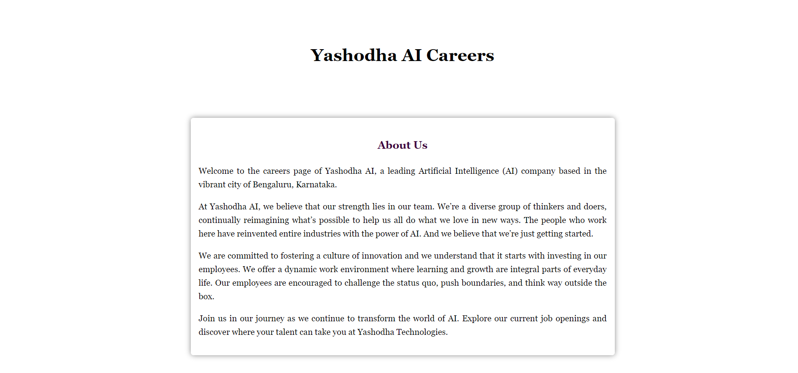
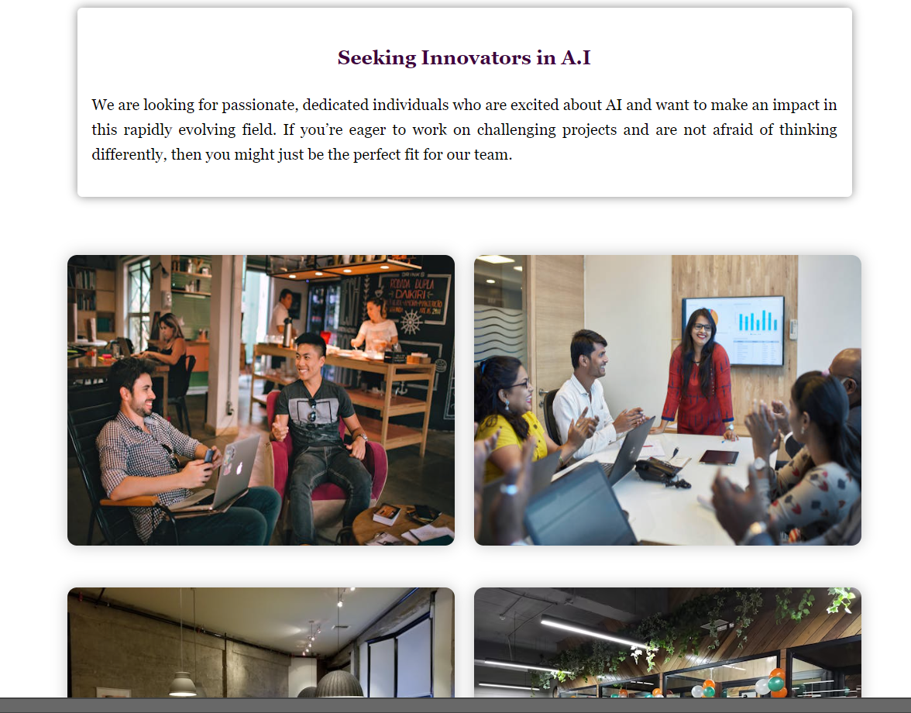
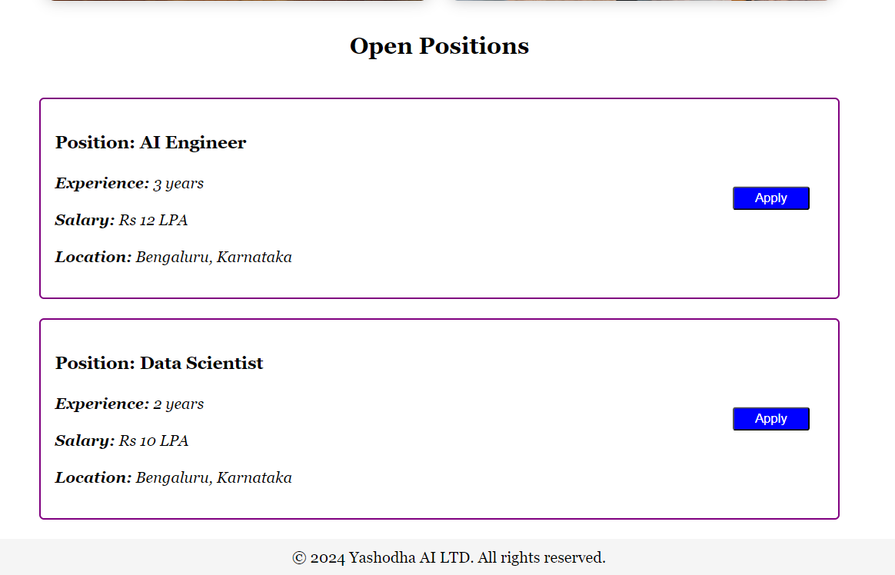
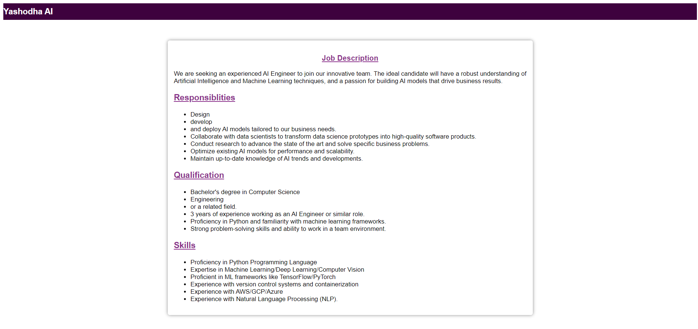
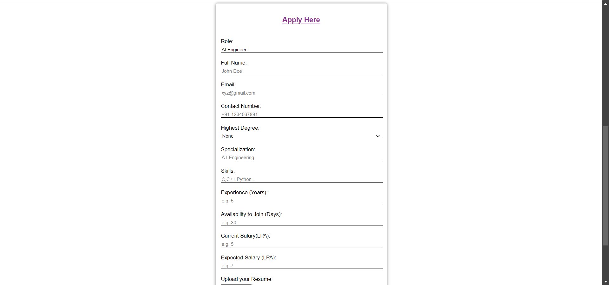
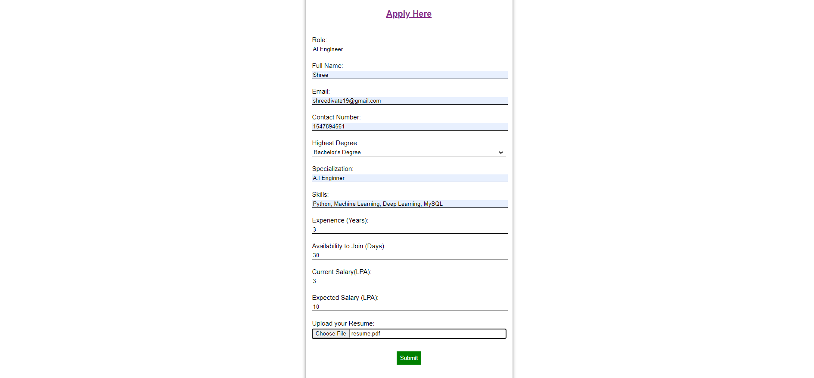
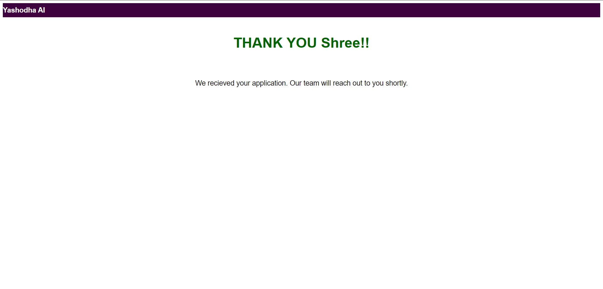

# Flask Career Page

## Description
This project is a simple career page built with Flask. It lists all the open positions in a company and provides a link to the application page for each job.

## Requirements
- Python
- HTML and CSS
- MySQL
- SQLAlchemy

## Features
- List of open positions
- Job application pages
- Applicant's information is stored in database
- Acknowledgement Message to the applicant
- Responsive design

## Future Improvements
- Improvement in front end
- Adding Registration and Login Page

## Contributing
- Contributions are welcome!

## Results:

* 

* 
 
* 

* 

* 

* 

* 

* 